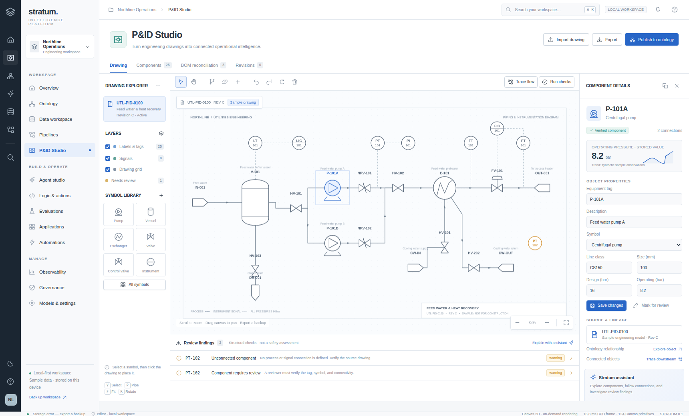

# Stratum Intelligence

**An original-branded, local-first operational intelligence workspace with a dedicated P&ID Studio.**

Version 0.1.0 · Plain JavaScript / HTML / CSS / WGSL · MIT license

Stratum connects an editable engineering diagram, an ontology, datasets, pipelines, grounded assistant queries, evaluations, and human-reviewed actions in one browser workspace. It is an executable application, not a set of static screen mockups. It is **not a feature-complete enterprise platform replacement**, an authenticated multi-user service, or a certified engineering analysis system. See [the capability matrix](docs/CAPABILITIES.md) for the exact boundary.



## Launch

**GitHub Pages:** https://wieslawsoltes.github.io/StratumIntelligence/

The site is published by `.github/workflows/pages.yml` after tests and the static build succeed. Deployment status is visible in the repository Actions tab.

The easiest portable entry point is **`stratum-intelligence.html`**. Open it in a browser. The core app and its worker are embedded; no framework installation is needed. A browser that restricts file URLs may disable persistence, workers, or GPU features. Read the actual engine and save status in the bottom bar. Export your workspace before closing a session-only tab.

For the modular source application, use Node.js 20 or later:

```sh
npm start
```

Open `http://localhost:8080`. An alternative port can be selected with `PORT=8765 node server.mjs` on macOS/Linux, or `$env:PORT=8765; node server.mjs` in PowerShell. The included server binds to loopback and only serves static files. It is not an authentication server or model proxy.

The application attempts WebGPU and falls back to Canvas 2D. Use a browser with WebGPU support on a permitted secure origin to exercise the GPU path. No account, API key, or model connection is required for the built-in sample workflows.

## A working first workflow

1. Open **P&ID Studio**. The sample is a feed-water and heat-recovery process with 25 components, 25 connections, and 20 ontology objects. Select **P-101A**, edit its properties, drag it, and try Undo/Redo.
2. Open **BOM reconciliation**. The sample intentionally contains a line-class mismatch for HV-102, a missing PT-102 entry, and an extra HV-999 entry. **Run checks** separately reports the disconnected/unreviewed PT-102. These are deterministic checks against the represented model, not safety findings against a real plant.
3. Use **Trace flow** to inspect upstream/downstream connectivity; save a baseline in **Revisions** before changing the drawing. **Publish to ontology** creates a frozen proposal. Review and approve it in **Governance** to apply the changes.
4. Run **Equipment readiness** in **Pipelines** and select **Save outputs as datasets**. The four real transformation blocks produce 19 active asset rows. In **Agent studio**, ask “Trace downstream from P-101A” or “Reconcile the bill of materials”. Run **Evaluations** to execute the four bundled assertion cases.

## Workspaces

| Workspace | Implemented behavior |
| --- | --- |
| Overview | Live workspace counts, evidence links, synthetic telemetry chart, numeric anomaly analysis |
| Ontology | Batched graph rendering, draggable object layout, object/schema/relationship editing, search and table views |
| Data workspace | CSV/JSON import, cell/row editing, profiling, read-only SQL subset, CSV export, document ingestion |
| Pipelines | Draggable and configurable transformation blocks, editable inputs, DAG validation, worker execution, run traces and materialized outputs |
| P&ID Studio | Diagram editor, process/signal connectivity, source-image annotation, structural checks, tag candidates, BOM reconciliation, revision baselines and staged ontology publication |
| Agent studio | Deterministic grounded queries with evidence/tool summaries; optional explicitly configured external model |
| Logic & actions | Reviewed ontology-edit, work-order and diagram-publication templates; inspectable proposed payloads |
| Evaluations | Editable question/expected-text cases, real assertion execution and retained result reports |
| Applications | Add/edit/remove/reorder metric, chart and table dashboard widgets |
| Automations | Manual and in-tab diagram-change triggers for validation, reconciliation and staged publication |
| Observability | Actual local run records, durations, execution summaries and exportable audit history |
| Governance | Pending/approved/rejected proposals and local review controls |
| Models & settings | Endpoint/model configuration, explicit sharing consent, memory-only API key, preferences, diagnostics, backup and reset |

## P&ID input and output

**Native diagram JSON and Stratum SVG** retain editable nodes and connections. Generic SVG is sanitized, retained as a visual source, and scanned for embedded tag text. PNG, JPEG and WebP are re-encoded as source images. Add and verify annotations manually; connect symbols with process or signal edges. Export native JSON, editable SVG, PNG, component CSV, reconciliation CSV or a full workspace backup.

**PDF support is optional.** The adapter uses PDF.js 6.3.289, loading a local `vendor/pdfjs` installation when present and otherwise a pinned CDN module. The dependency is not bundled in this release and could not be integration-tested in the restricted build environment. PDF text extraction is not OCR: scanned pages require manual annotation or an external vision model. Generic SVG text transforms are not interpreted; candidate positions need review.

**Vision extraction requires your image-capable endpoint.** The app shows an explicit send-confirmation, validates the returned component/connection schema and presents a review table before adding candidates. Every detection remains unverified; no model confidence is presented as calibrated confidence. No image recognition weights or OCR engine are included.

## External model connection

In **Models & settings**, enter the complete chat-completions endpoint, the provider's model identifier and an optional API key. An image-capable model can be selected separately. The endpoint must support browser CORS, POSTed JSON, and `choices[0].message.content` responses. Requests are not streamed in this release.

Enable **Share context** only after checking what will be sent. The text assistant sends the current diagram representation, structural findings, selected retrieved documents, up to 100 ontology objects, recent conversation turns and the question. Vision requests send the imported source image. The provider's privacy, retention and billing terms apply. The key is held in JavaScript memory only; it is not persisted or included in exported workspaces.

The **local assistant is a deterministic tool router, not an LLM**. The UI labels it accordingly. External text responses cannot execute writes or approve actions. A local review queue is not a security or authorization boundary against another script or a person with browser access.

## Engineering and performance

The geometry engine retains tessellated vertex batches in WebGPU buffers. Pan/zoom updates a 32-byte uniform, not all vertices. Text is rendered in a separate Canvas overlay. Frames are requested only on changes; there is no idle render loop. Data transformations use a real worker, with a startup handshake and a main-thread fallback when worker creation is restricted.

The WGSL compute path evaluates numeric z-scores with workgroups of 256 and returns the scores to the CPU. CPU fallback uses the same population-standard-deviation formula. GPU code is implemented, but **WebGPU rendering and compute were not executable in the policy-restricted test browser**. No target-hardware performance claim is made. The measured status is CPU submission/drawing time, not GPU frame duration. Storage limits and performance depend on the browser and input; import caps are guardrails, not proven scale guarantees.

## Development and tests

```sh
npm test
python3 tools/build-singlefile.py
```

The source has no build dependency. Python is required only to regenerate the optional single-file release. Browser regression scripts use the optional Playwright Python package and a locally installed Chromium binary; see [testing notes](docs/TESTING.md).

| Folder | Contents |
| --- | --- |
| `src/core` | State, interchange, expressions, data DAGs, graph checks, assistant adapter, workers |
| `src/render` | Scene primitives, tessellation, WebGPU renderer/compute, interactive editor |
| `src/ui` | Accessible HTML view templates, controls and original inline SVG icons |
| `src/app.js` | Navigation, commands, forms, workflow orchestration and integration |
| `examples` | Editable sample diagram/workspace, equipment/BOM/telemetry CSV, pipeline and vision-response examples |
| `tests` | Core unit/contract tests and browser regression scripts |
| `docs` | Architecture, capability boundary, engineering algorithms, security and test evidence |

## Deployment and data handling

The GitHub Pages workflow tests the source, verifies the portable HTML build, stages the public runtime in `_site/`, and deploys using the official GitHub Pages actions. It runs on pushes to `main` and can be run manually. GitHub Pages must use **GitHub Actions** as its publishing source in **Settings → Pages**.

For other static hosts, run `npm run build:pages` and publish `_site/`. `index.html` uses relative module paths, including at the `/StratumIntelligence/` project URL. Keep the site's permissions and model endpoint CORS policy appropriate for your data. Static hosting does not make this a multi-user server application.

The app uses IndexedDB when available. Undo/redo retains up to 40 whole-state snapshots in the current tab. Revision baselines and workspace exports are explicit. Browser storage is not a backup: export important work. Exported files may contain diagrams, documents, conversations and operational data in plaintext. The sample records are synthetic and must not be used to operate equipment.

Stratum is original code and branding inspired by publicly documented operational-intelligence workflows and enterprise UI patterns. It contains no commercial product source, logos, proprietary datasets or model weights. Reference sources are listed in [docs/REFERENCES.md](docs/REFERENCES.md).

Documentation screenshots can be regenerated with `python3 tools/capture-screenshots.py` using the same optional Playwright dependency as the browser tests. They depict synthetic sample data, not a production deployment or GPU performance certification.

